# Asa Akam Qeshm

Asa akam company's website would provide services and information to the people who are interested in importing and/or purchasing dyestuff and textile auxiliaries in Tehran, Iran. The website targets the costumers from all types of industries in purchasing imported dyes and textile auxiliaries. Asa Akam company's website would showcase its wide range of products and its partners from around the world.

# User Story

## User Stories Backlog

### Trustworthy company

As a user, I would like to be able to get information about the asa akam company. I want to see if the company is trustworthy or not.

**Acceptance Criteria**

Given that I would check the about us section to see if I can get valuable information on the company.

### **Well-equipped lab**

As a user who is working in the same field, I would like to be able to know if the company has its own lab so we could just ask them to sample our products for us.

**Acceptance Criteria**

Given that I would check the about us section to see if there's any place on the website which shows this and I find it in the second section of about us section.

### Company's location

As a website user, I would like to know the address of the company.

**Acceptance Criteria**

Given that I would click on the 'contact' section on the menu bar which takes me to a form which is followed by the addresses of the company and its email address.

## To do

### **Feedback**

As a  web user, I would like to be able to ask questions and give feedback to the company.

**Acceptance Criteria**

Then, I would check the menu bar section to see if I can get valuable information on that. Then I click the contact. I fill out the form and submit it to the website.

## In progress

### **Looking for partners**

As a user, I would like to where does this company imports its products from.

**Acceptance Criteria**

Therefore, I would go into the company's products with a click on the 'product' item on menu bar and see the list of partners and range of products. I would click on the companies names to see where the companies are from and get some additional information on them.

### **Looking for products**

As a  web user, I would like to check the products of the company so I could see if I should contact them or not.

**Acceptance Criteria**

Given that I would check the menu bar section to see if I can get valuable information on that. Then I click the products section and it takes me to company's business partners and it shows me the range of their products.

### **Looking for a specific  product**

As a  web user, who is familiar with these range of products. I would be looking for contact section.

**Acceptance Criteria**

Then, I would look into the contact section which placed on the menu bar and call the company or send them my exact formula of the product I need.

## Complete

### **Links to social-media**

As a  website user, I'd like to find the company on linked in, twitter or facebook.

**Acceptance Criteria**

Therefore, I would go to the bottom of the page where this links are usually placed and click on them/ I would click on 'contact' in the menu bar and simply find them at the bottom of the page.
## Features
***
  ### Header section
 * A header which has the nav bar inside it, It consists both fonts of website and the plain white color would compliment the website.
 * It showcases the company's logo. \
 **navigation bar**
 * This section would allow the user to navigate through different parts of the website, it highlights the information that you are going to get by visiting this website. It includes links to *About Us*, *Products* and *Contact* sections and the logo would refresh the page.
 ### Landing hero image
 * A landing hero image with eye-catching color which would showcase a heading which would be vertically and horizontally centered.
 ### About Us section
 * Showcases two sections consistant of information about the company(on the left) alongside an image(on the right).
 *  The text section would give the user more history about the company and assure them of the services which company provides. It also showcases the lab option of the company to give user a better information about what company does. The text includes *About our company*, *Our lab* and *Our services* sections. 
 ### Partners section
 * This section showcases the company's real partners in importing dyestuff and textile auxiliaries and links which open in a new tab.
 ### Table section
* This section showcases the range of the products in two seperate charts including *dyestuff* and *textile auxiliaries*.
### Contact Us section
* The user could contact the company directly via the form which is placed within the page.
### Footer section
* This section contains the two addresses of the company, the company's email address, links to social media. 
* Copyright would be added at the end of footer.
## Future Features
***
All these future features would improve the UX of the website:
* The range of products could be improved and updated as the number of the partners.
* We could add other sections to the website like the catalogues and the certificates and company's presence in other exhibitions.
* The form could have more validations and options for the user.
## Typography and Color Scheme
***
### Fonts
* The font used for headings: *Bebas Neue*
* The font used for body : *Roboto*
* The backup font for both: *sans-serif*
### Color Scheme
* Headings, texts, footer-background: #3a3a3a
* Background, footer-heading and copyright: #FDB866
* Navigation-bar, heading, background: #f5f5f5
* Navigation-bar border and anchors on hover: #ec4a0f 

## Wireframes
***
**Header**
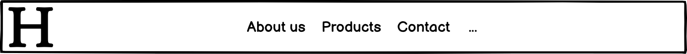
**Landing image and heading**
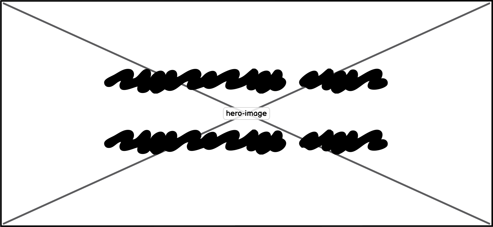
**About us**
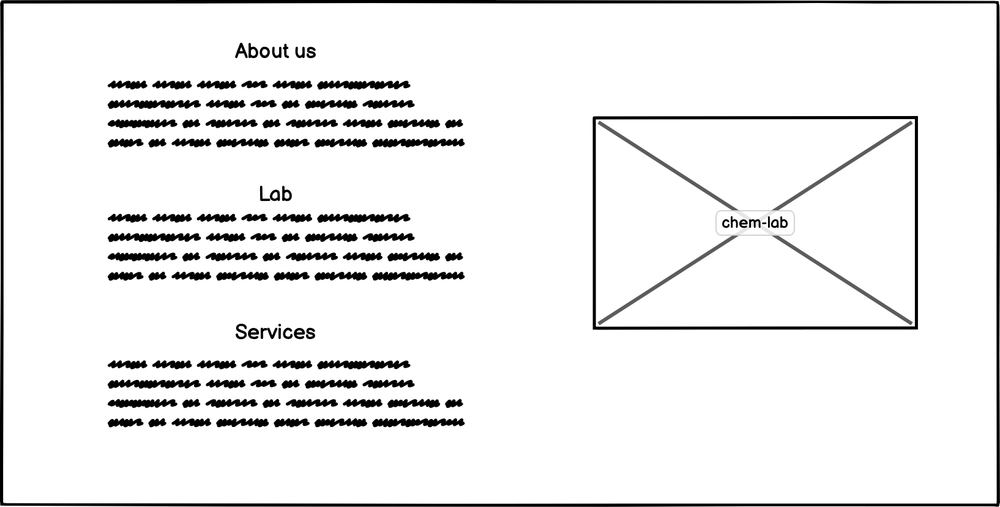
**Products**
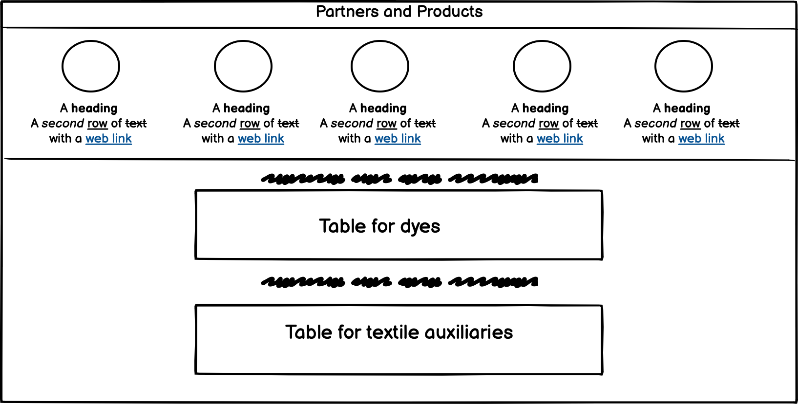
**Contact**
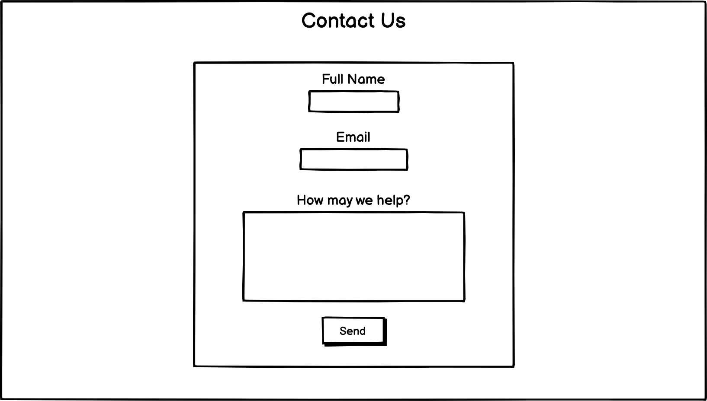
**Footer**
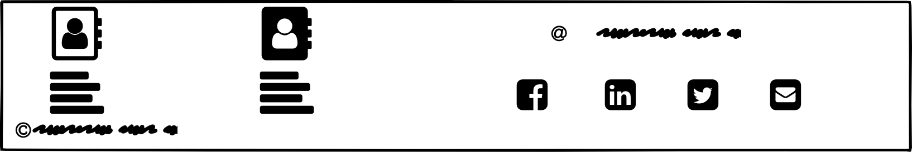
## Technology
***
### Languages used:
> HTML5  
> CSS3
### Programs used:
> Github: *It was used to store the project codes after being pushed at gitpod.*
> Gitpod: *It was used to write the codes and pushed the code to github via terminal commit command.*  
> Balsamiq: *It was used to create the wireframes for the project.*
> Fontawesome website: *It was used for the icons on the website but not the main logo.*
> Tinypng website: *It was used to reduce the size of the images and icons used on the web page.*
> Milanote app: *It was used for better understanding and writing the main user stories at and then importing to the readme.md*
## Testing
***
> **Validator Testing** 
>>* HTML: *no errors were found*[W3S-validator]()
>>* CSS: *no errors were found*[Jigsaw-validator](https://jigsaw.w3.org/css-validator/validator?uri=https%3A%2F%2Fniloomisa.github.io%2Fasa-akam-qeshm%2F&profile=css3svg&usermedium=all&warning=1&vextwarning=&lang=en)
>>* The colors of the content and background have been checked and the content is readable.
>>**Accesibility**
>>* Results for desktop
>* Results for mobile
>>## Test cases
>>* The user could navigate through the website with the sticky menu bar and the logo would refresh the page.
>>* The menu bar would fade while scrolling in the homepage and reappears on *About Us* section.
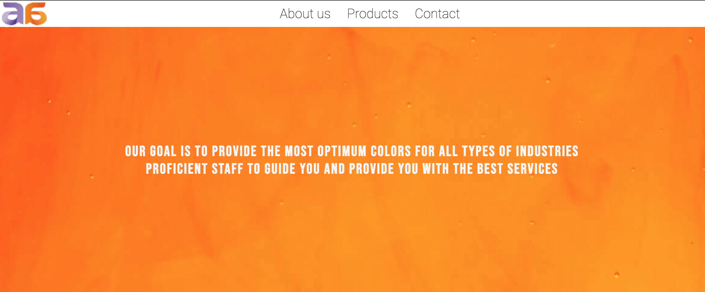
>>* By clicking on the *About Us*, the user would be navigatet to this section.
>>* The sticky menu bar would help the user further as it is on the page again.
>>* In responsive design for small devices the image would be palced under the paragraphs.
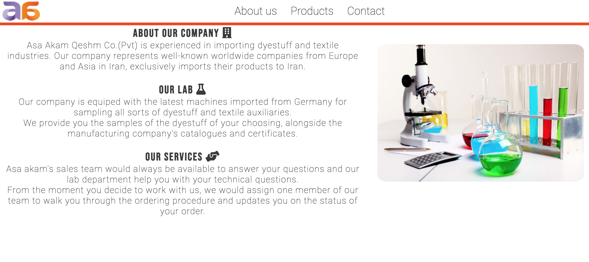
>>* By clicking on products and also while scrolling down, the user could see the name of the partners and range of products.
>>* Four out of five partners have direct links to their websites.
>>* In responsive design for small screens, each company would take 100% of the viewport width and appear vertically.
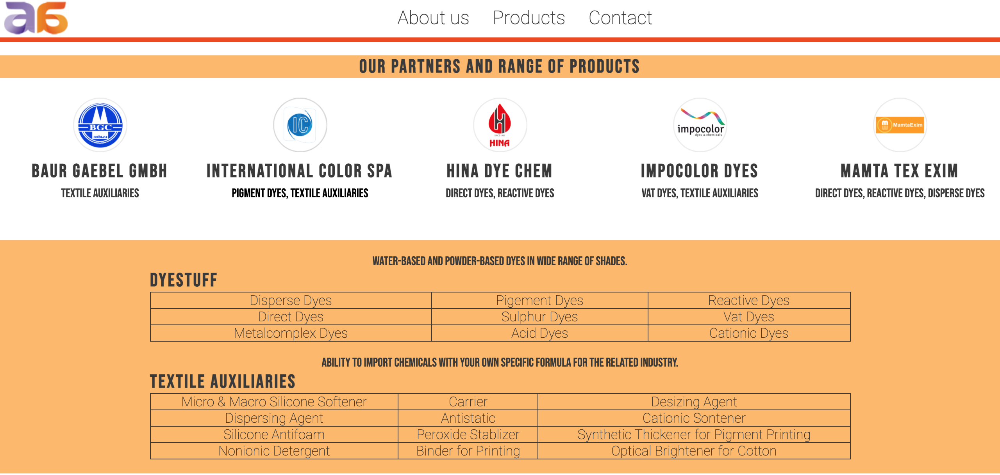
>>* By clicking on contact and while scrolling down, the user could see the form which is provided and fill it out.
>>* The form requiers email and name to be submitted.
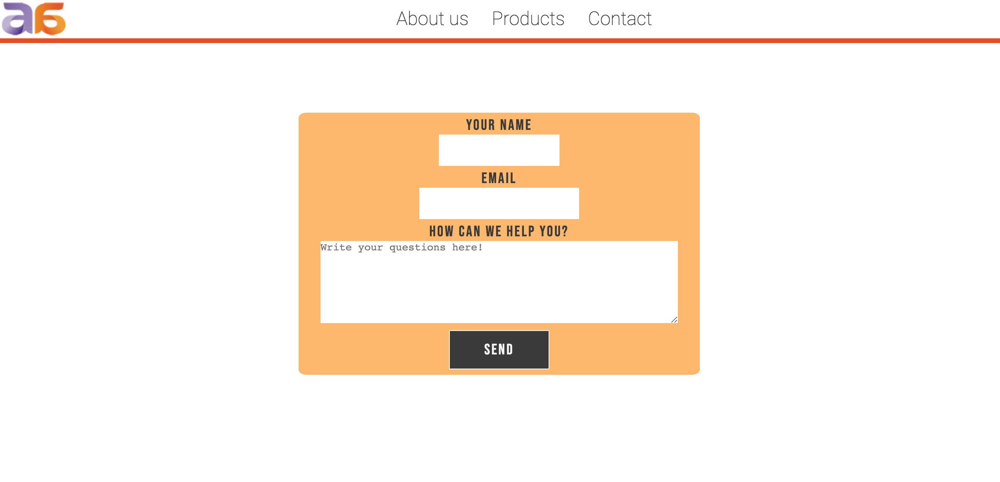 
>>* The user could also find the addresses and the links to social media at the footer.
>>* In responsive design the addresses and social media links would appear vertically.
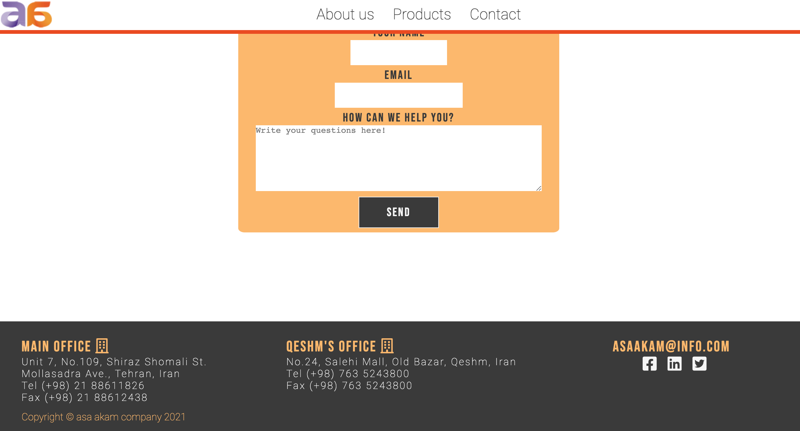
>* The logo always refreshes the page and takes you to the homepage.
### Fixed Bugs
* I have centered the heading in homepage and form without using position, instead using line-height and display.
* Fixed the broken links on the website.
### Unfixed bugs
* Because of using vh value, the website is more responsive in landscape mode on ipad and such devices. However, it is responsive on portrait for small devices.
* The navigation bar fades over the hero image and reappears after that section, because both have overflow:hidden; property, I have searched and couldn't find a good solution for that while maintaining the structure of the page.
## Supported screens and browsers
***
### Browsers 
The website was written and tested on Chrome browser.
### Screens
The website is responsive on these devices: 
* Moto G4
* Galaxy S5
* Pixel2
* iphone SE/5/6/7/8-6/7/8 plus/X
* Laptops/Desktop
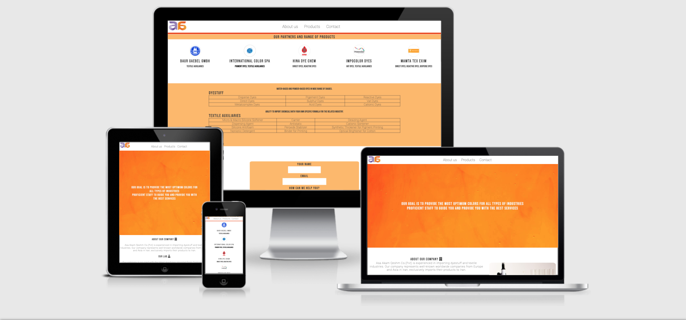
On tablet(ipad/ipad pro) devices, the landscape mode is responsive:
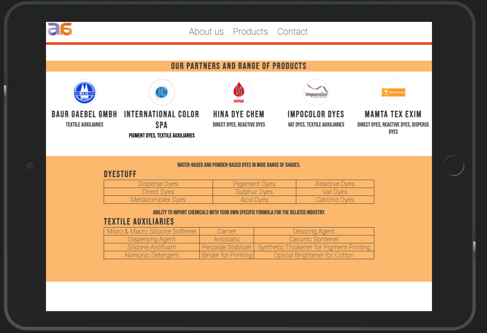

## Deployment
***
The website was deployed to GitHub pages. Here are the steps:
1. In the GitHub repository, navigate to the Settings tab
2. Scroll down to *GitHub pages* section, select the Master Branch(main)
3. Once the master branch has been saved, the page will be automatically refreshed with a detailed ribbon display to indicate the successful deployment.

Here is the link to the live site  https://niloomisa.github.io/asa-akam-qeshm/

## Credits
***
### Content
- The content was provided by the company.
- Inspiration from Love Running project and Coding Club on [CI](https://codeinstitute.net) LMS.

### Media
- The hero image was takes from [unsplash](https://unsplash.com/photos/GAM-7l4QzmI) and the credit goes to the photographer Lucas Benjamin.
- The company logo and other companies were used with permission and image on about-us section was also provided by the company. 

   
