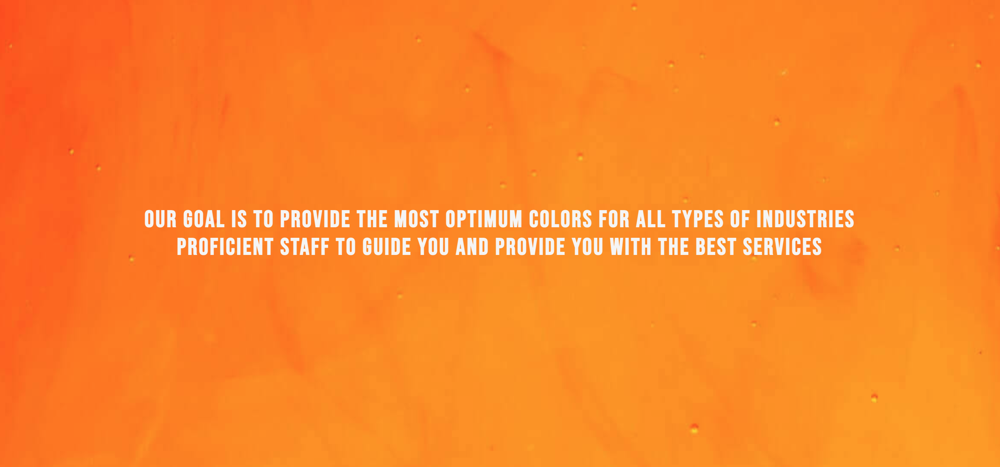
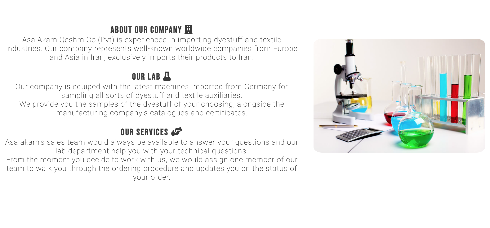
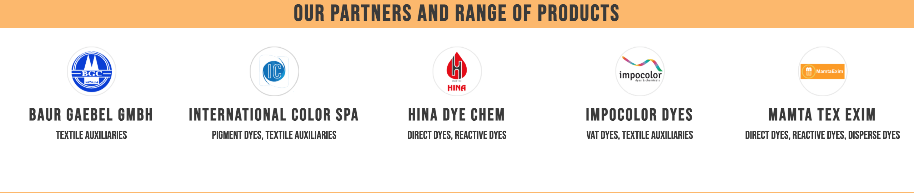
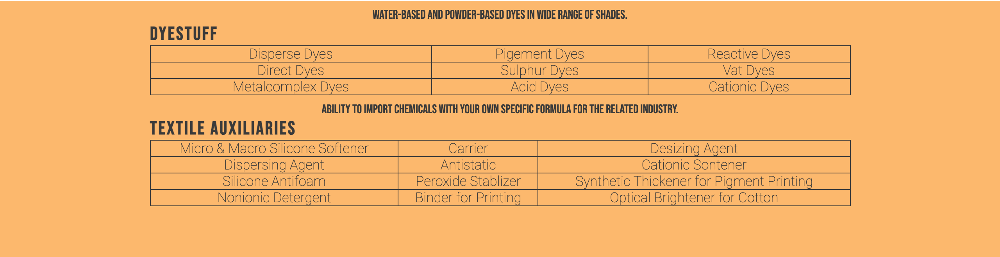
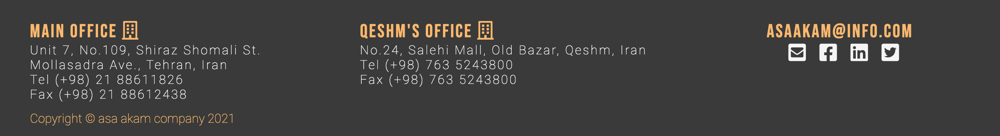

# Asa Akam Qeshm

Asa akam company's website would provide services and information to the people who are interested in importing and/or purchasing dyestuff and textile auxiliaries in Tehran, Iran. The website targets the costumers from all types of industries in purchasing imported dyes and textile auxiliaries. Asa Akam company's website would showcase its wide range of products and its partners from around the world.

# User Story

## User Stories Backlog

### Trustworthy company

As a user, I would like to be able to get information about the asa akam company. I want to see if the company is trustworthy or not.

**Acceptance Criteria**

Given that I would check the about us section to see if I can get valuable information on the company.

### **Well-equipped lab**

As a user who is working in the same field, I would like to be able to know if the company has its own lab so we could just ask them to sample our products for us.

**Acceptance Criteria**

Given that I would check the about us section to see if there's any place on the website which shows this and I find it in the second section of about us section.

### Company's location

As a website user, I would like to know the address of the company.

**Acceptance Criteria**

Given that I would click on the 'contact' section on the menu bar which takes me to a form which is followed by the addresses of the company and its email address.

## To do

### **Feedback**

As a  web user, I would like to be able to ask questions and give feedback to the company.

**Acceptance Criteria**

Then, I would check the menu bar section to see if I can get valuable information on that. Then I click the contact. I fill out the form and submit it to the website.

## In progress

### **Looking for partners**

As a user, I would like to where does this company imports its products from.

**Acceptance Criteria**

Therefore, I would go into the company's products with a click on the 'product' item on menu bar and see the list of partners and range of products. I would click on the companies names to see where the companies are from and get some additional information on them.

### **Looking for products**

As a  web user, I would like to check the products of the company so I could see if I should contact them or not.

**Acceptance Criteria**

Given that I would check the menu bar section to see if I can get valuable information on that. Then I click the products section and it takes me to company's business partners and it shows me the range of their products.

### **Looking for a specific  product**

As a  web user, who is familiar with these range of products. I would be looking for contact section.

**Acceptance Criteria**

Then, I would look into the contact section which placed on the menu bar and call the company or send them my exact formula of the product I need.

## Complete

### **Links to social-media**

As a  website user, I'd like to find the company on linked in, twitter or facebook.

**Acceptance Criteria**

Therefore, I would go to the bottom of the page where this links are usually placed and click on them/ I would click on 'contact' in the menu bar and simply find them at the bottom of the page.
## Features
***
  ### Header section
 * The full responsive header which has the nav bar inside it, It consists both fonts of website and the plain white color would compliment the website.
 * It showcases the company's logo, name and a small description of what company does. \
 **navigation bar**
 * This section would allow the user to navigate through different parts of the website, it highlights the information that you are going to get by visiting this website. It includes links to *About Us*, *Products* and *Contact* sections.
 * The elements would get style which underline and highlight them while hover.
    
 ### Landing hero image
 * A landing hero image with eye-catching color which is showcasing a heading which is vertically and horizontally centered.
 * The image and text have animation effect which is responsive in different platforms. 
 
 ### About Us section
 * Showcases two sections consistant of information about the company(on the left) alongside an image(on the right).
 *  The text section would give the user more history about the company and assure them of the services which company provides. It also showcases the information about the lab of the company to give user a better information about what company does. The text includes *About our company*, *Our lab* and *Our services* sections. 
 * The text content would take full-width of viewport in responsive designs and the image would come at the end of the texts. 
 
 ### Partners section
 * This section showcases the company's real partners in importing dyestuff and textile auxiliaries and links which open in a new tab.
 * This section would be updated in the name or the number of the current partners change.
 * The design of the companies would change in responsive design for small devices and each company section would take the full-width of the viewport.
 
 ### Table section
* This section showcases the range of the products in two seperate charts including *dyestuff* and *textile auxiliaries*.
* The tables are responsive in all platforms and the style is consistant with the page.
* The content of the tables could be updated in the future while the table keeps its responsiveness.

### Contact Us section
* The user could contact the company directly via the form which is placed within the page.
* The form style matches the page and it's responsive for all platforms. The form needs full-name and email address to be sent.

### Footer section
* This section contains the two addresses of the company, the company's email address, links to social media and direct email link to company. This option is provided as an additional way of communicating with the company.
* The colors in styling are consistant with the website and copyright is also added at the end of footer.
* In responsive design, addresses and email address would come on top of each other.

## Testing
***
> **Validator Testing** 
>>* HTML: *no errors were found*[W3S-validator]()
>>* CSS: *no errors were found*[Jigsaw-validator]()
>>* The colors of the content and background have been checked and the content is readable.
>>**Lighthouse**
>>* Results for desktop
>>* Results for mobile
>>### Unfixed bugs
>* ----
## Deployment
***
The website was deployed to GitHub pages. Here are the steps:
1. In the GitHub repository, navigate to the Settings tab
2. Scroll down to *GitHub pages* section, select the Master Branch(main)
3. Once the master branch has been saved, the page will be automatically refreshed with a detailed ribbon display to indicate the successful deployment.

Here is the link to the live site  https://niloomisa.github.io/asa-akam-qeshm/

## Credits
***
### Content
- The icons were taken from [fontawesome](https://fontawesome.com/).
- The codes for centering the paragraph on home page within the hero-image and form section were from [W3S](https://www.w3schools.com/howto/howto_css_center-vertical.asp).
- The content was provided by the company.
- Love Running project and Coding Club on [CI](https://codeinstitute.net) LMS.

### Media
- The hero image was takes from [unsplash](https://unsplash.com/photos/GAM-7l4QzmI) and the credit goes to the photographer Lucas Benjamin.
- The company logo and other companies were used with permission and image on about-us section was also provided by the company. 

   
